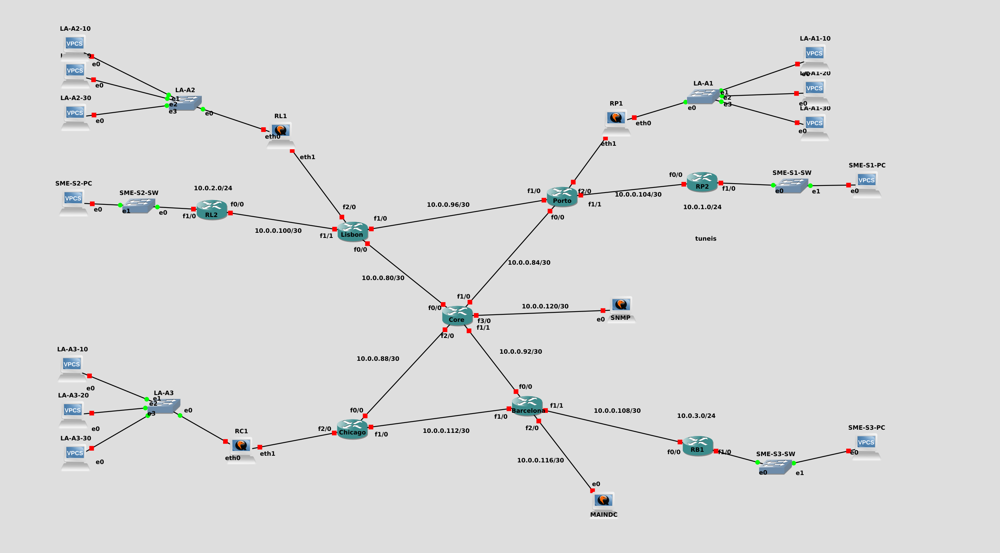
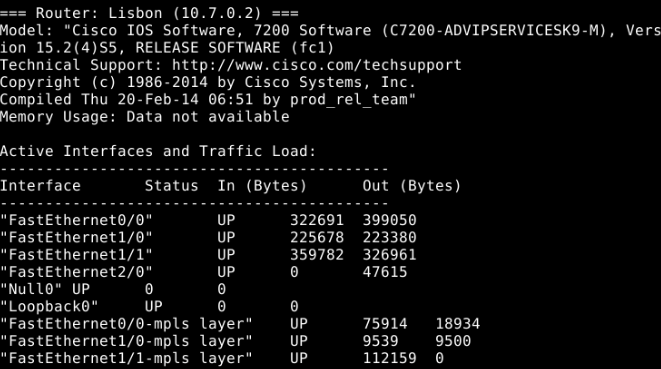

# CDN4ALL Report
Authors: Miguel Matos (103341), João Monteiro (102690)

## Introduction

This report details the technical design, configuration, and testing of a CDN network. The network interconnects multiple Points of Presence (PoPs) across Porto, Lisbon, Barcelona, and Chicago, supporting both large enterprise clients and an SME industrial association.

## Network Topology

The CDN4ALL network architecture includes:
- **Core Network:** Core router interconnects all PoPs.
- **Points of Presence (PoPs):** Located in Porto, Lisbon, Barcelona, and Chicago.
- **Client Connections:** Direct connections for large client LA and SMEs (SME1, SME2, SME3).
- **Private Networks:** Dedicated links with guaranteed bandwidth for SMEs and private Ethernet networks for client LA.

The interconnection utilizes the IPv4 network 10.0.0.0/24 with OSPF for dynamic routing.

The following figure illustrates the developed network:



## Basic Assembly and Core Connectivity

The following table lists the basic assembly and core connectivity details:

| Addresses  | Mask | Point A   | Endpoint | Point B   | Endpoint |
|------------|------|-----------|----------|-----------|----------|
| 10.0.0.80  | 30   | Core      | 81       | Lisbon    | 82       |
| 10.0.0.84  | 30   | Core      | 85       | Porto     | 86       |
| 10.0.0.88  | 30   | Core      | 89       | Chicago   | 90       |
| 10.0.0.92  | 30   | Core      | 93       | Barcelona | 94       |
| 10.0.0.96  | 30   | Lisbon    | 97       | Porto     | 98       |
| 10.0.0.100 | 30   | Lisbon    | 101      | RL1       | 102      |
| 10.0.0.100 | 30   | Lisbon    | 101      | RL2       | 102      |
| 10.0.0.104 | 30   | Porto     | 105      | RP2       | 106      |
| 10.0.0.108 | 30   | Barcelona | 109      | RB1       | 110      |
| 10.0.0.112 | 30   | Chicago   | 113      | Barcelona | 114      |
| 10.0.0.116 | 30   | Barcelona | 117      | MAINDC    | 118      |
| 10.0.0.120 | 30   | Core      | 121      | SNMP      | 122      |

The loopback addresses for each router are as follows:

Router    | Loopback0 Address
----------|-----------------
Core      | 10.7.0.1
Lisbon    | 10.7.0.2
Porto     | 10.7.0.3
Barcelona | 10.7.0.4
Chicago   | 10.7.0.5
RL2       | 10.7.0.6
RP2       | 10.7.0.7
RB1       | 10.7.0.8

OSPF is configured to ensure dynamic routing between all core routers.

```
Core#show ip ospf int brief
Interface    PID   Area            IP Address/Mask    Cost  State Nbrs F/C
Lo0          1     0               10.7.0.1/32        1     LOOP  0/0
Fa3/0        1     0               10.0.0.121/30      1     DR    0/0
Fa2/0        1     0               10.0.0.89/30       1     BDR   1/1
Fa1/1        1     0               10.0.0.93/30       1     BDR   1/1
Fa1/0        1     0               10.0.0.85/30       1     BDR   1/1
Fa0/0        1     0               10.0.0.81/30       1     BDR   1/1
```

## SME1, SME2, and SME3 Association

To ensure separation and guaranteed bandwidth for SME1, SME2, and SME3, a private network was established. The configuration employs VRF instances, MP-BGP VPNv4, and OSPF. Traffic engineering is performed using RSVP-TE tunnels.

### VRF Configuration
All edge routers implement identical VRF configuration for consistency:
```
ip vrf SME
  rd 21200:1
  route-target export 21200:1
  route-target import 21200:1
```

### BGP VPNv4 Configuration

MP-BGP peering using loopback addresses provide VPN route exchange and distribution. The following sample configuration is applied at the RP2 router:
```
router bgp 21200
  bgp log-neighbor-changes
  neighbor 10.7.0.6 remote-as 21200
  neighbor 10.7.0.6 update-source Loopback0
  neighbor 10.7.0.8 remote-as 21200
  neighbor 10.7.0.8 update-source Loopback0
  neighbor 10.7.0.4 remote-as 21200
  neighbor 10.7.0.4 update-source Loopback0
address-family vpnv4
  neighbor 10.7.0.6 activate
  neighbor 10.7.0.6 send-community both
  neighbor 10.7.0.8 activate
  neighbor 10.7.0.8 send-community both
  neighbor 10.7.0.4 activate
  neighbor 10.7.0.4 send-community both
```

### Traffic Engineering Configuration

RSVP-TE tunnels are established over the MPLS network to ensure guaranteed 10Mbps bandwidth for SME1, SME2, and SME3. The following configuration is applied at the RL2 router, in order to establish one of these tunnels to RP2:
```
interface Tunnel0
  ip unnumbered Loopback0
  tunnel mode mpls traffic-eng
  tunnel destination 10.7.0.7
  tunnel mpls traffic-eng autoroute announce
  tunnel mpls traffic-eng priority 7 7
  tunnel mpls traffic-eng bandwidth 10000
  tunnel mpls traffic-eng path-option 1 dynamic
  no shutdown
```

RSVP Bandwidth is also reserved on router interfaces to ensure the tunnel bandwidth is available:
```
interface FastEthernet0/0
  ip rsvp bandwidth 100000 10000
```

### Advanced Service Routing

A CDN service routing architecture is implemented to ensure client requests are efficiently routed to the most appropriate node. A Debian-based BIND DNS server, hosted at the Barcelona PoP, was configured. This approach allows for dynamic DNS resolution based on client location.

Multiple DNS zones are configured to support SME1, SME2 and SME3. The server resolves domain names specific to each SME and ensures requests are directed to the closest PoP.

The following configuration illustrates a DNS zone definition for SME1 (Porto):
```
view "ptpor" {
    match-clients { PTPOR; };
    recursion no;
    zone "cdn.cdn4all.com" {
        type master;
        file "/etc/bind/cdn-ptpor.db";
    };
}
```

Each zone file contains DNS records that map the client domain to the appropriate PoP IP address. Below is an example of the zone file for SME1 (Porto):
```
$TTL 86400
@   IN  SOA ns1.cdn.cdn4all.com. admin.cdn.cdn4all.com. (
            2021102001
            28800
            7200
            604800
            86400 )
@   IN  NS  ns1.cdn.cdn4all.com.
@   IN  A   10.0.1.1
@   IN  A   10.0.0.118
```

## Client LA

Client LA requires a dedicated Ethernet private network to interconnect its server clusters (A1, A2, and A3), with specific VLAN segmentation and traffic differentiation mechanisms. 

### Private Network

Client LA's infrastructure is built on a Layer 2 Ethernet private network to ensure interconnection between its server clusters. The network is subdivided into three VLANs:

- VLAN 10: 10.10.0.0/24
- VLAN 20: 10.20.0.0/24
- VLAN 30: 10.30.0.0/24

#### Vyos Router Configuration
The Vyos is configured to handle VLANs using virtual interfaces. These interfaces are associated with the physical Ethernet adapter and tagged with their respective VLAN IDs.

```bash
configure
set interfaces ethernet eth1 vif 10 address 10.10.0.6/24
set interfaces ethernet eth1 vif 20 address 10.20.0.6/24
set interfaces ethernet eth1 vif 30 address 10.30.0.6/24
```

### Traffic Differentiation

#### SNMP Monitoring Tool

A SNMP monitoring tool was implemented to provide real-time monitoring of the network. The tool is hosted at the LabCom VM, and consists of a bash script that queries SNMP data from all cisco devices.

#### SNMP Configuration on Routers
Each router in the network was configured to support SNMP. The SNMP configuration includes:
- Enabling SNMP services on the routers.
- Setting a common SNMP community string ("public") to allow access.
- Location configuration The snmp-server location command was used to identify the location of each router to help in device context during monitoring.

Example of router configuration to enalbe SNMP:
```bash
snmp-server community public RO
snmp-server location Lisbon
```

#### LabCom VM Integration

The LabCom VM was configured with:

- To the VM was assigned an IP address within the Core router subnet and the Core IP as the default gateway.
- In the VM a SNMP monitoring tool (using bash) was implemented to provide real-time insights into the network's performance and resource utilization. This tool queries the routers using their loopback IPs.

Example of the monitoring output:
